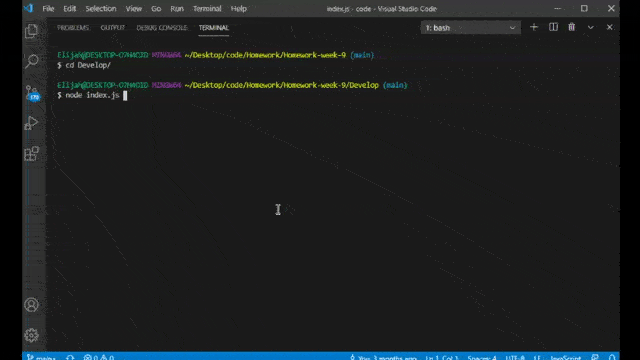

# GoodReadmeGenerator

## Description

This is a simple CLI written in nodeJS that helps users create good READMEs.



## Table of Contents

* [Installation](#installation)
* [License](#license)
* [Contributing](#contributing)
* [Questions/Contact](#questions/contact)


## Installation

Download the repo and ```NPM i```.  Launch using ```node index.js```.


## License

[](https://lbesson.mit-license.org/)

This project is covered under the MIT.  Click the badge above to learn more.


## Contributing

To contribute to the project, send me a message on github.


## Questions/Contact

 http://github.com/emelanson

 My email is (my first and last name)@gmail.com
